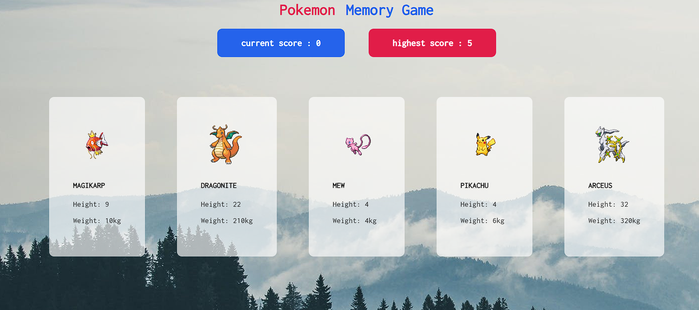

# memory-card
The main goal of this project is to implement the concepts learned so far by using hooks to manage and utilize state while fetching and using data from an external API.

Instructions:

*Click on any card.
*Commit the revealed card to memory.
*Avoid clicking on the same card again; doing so will end the game.
*Continue selecting different cards, remembering each one.
*The goal is to uncover as many unique cards as possible without repeating selections.
*If you click on the same card twice, the game will conclude.
*Challenge yourself to see how many distinct cards you can uncover before the game ends.

